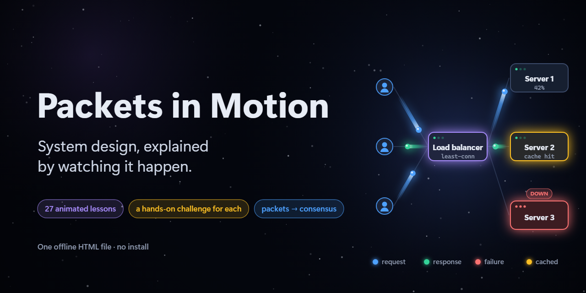

# Packets in Motion

**System design, explained by watching it happen.**

An animated, interactive course that takes you from "how do two computers talk?" to consensus, distributed transactions and a full URL-shortener design. Every concept is taught through motion: glowing requests leave light trails between servers, caches fill up, servers fail and traffic reroutes. Then you solve a hands-on challenge for each lesson.

## Run it

It's a single self-contained HTML file with no dependencies, no build step and no network requests.

Open `index.html` in any modern browser. That's it.

## What's inside

27 chapters in 9 sections, from zero to advanced:

| Section | Chapters |
| --- | --- |
| Start Here | How computers talk: packets, IP addresses & ports |
| Foundations | Client–server & typing a URL · Latency vs throughput, vertical vs horizontal scaling |
| Traffic | Load balancers · Reverse proxies & API gateways · CDNs & edge caching · Rate limiting |
| Data | SQL vs NoSQL · Indexing · Replication · Sharding · Caching & LRU · CAP & consistency |
| Communication | REST vs gRPC vs WebSockets · Message queues & pub/sub · Sync vs async |
| Reliability | SPOFs & redundancy · Health checks, failover, circuit breakers, retries · Idempotency |
| Architecture | Monolith vs microservices · Event-driven · Observability |
| Advanced | Consensus & leader election (Raft) · Two-phase commit & sagas · Snowflake IDs · Back-pressure & load shedding |
| Capstone | Design a URL shortener, end to end |

Each chapter has a 28–62 s animation, play/pause/replay, a scrubber with step markers, synced captions, and a "When to use it / Trade-offs" card at the end.

## Challenges

Every lesson ends with a hands-on challenge played on the same stage, scored with 1–3 stars (saved in your browser and shown in the sidebar). A few examples:

- **Be the load balancer**: route requests by hand for 30 seconds without overflowing a server.
- **Survive launch day**: pick machine sizes and counts, then watch traffic climb and a machine crash.
- **Beat LRU**: choose what to evict from a tiny cache and try to match the algorithm.
- **Keep it serving**: promote a follower the moment the leader dies.
- **Stop the retry storm**: tune retries, backoff, jitter and a circuit breaker through an outage.
- **Find the culprit**: use metrics, logs and a trace to find a slow service.
- **Launch the shortener**: build the whole system and survive a viral spike, a dead server and a bot attack.

The rest use the same kinds of mechanics: sort cards into boxes, put steps in order, or tune a system and run it.

## Visual language

- Servers are rounded rectangles, databases are cylinders, users are circles, and requests are glowing dots.
- **Blue** = request · **green** = success / response · **red** = failure · **amber** = cached / queued.

## Controls

| Key | Action |
| --- | --- |
| Space | Play / pause |
| ← / → | Seek 2 s |
| `[` / `]` | Previous / next chapter |
| P | Start the chapter's challenge (Esc to leave) |
| 1–9 | Jump to a step |
| C | Toggle captions |
| T | Trade-offs card |
| F | Fullscreen |

On phones the course runs in landscape. Held upright, it asks you to rotate the phone and pauses until you do.

## How it works

Everything is drawn on a `<canvas>` by code. Each chapter is a pure `draw(t)` function, so `seek(t)` reproduces any moment exactly, whether you scrub, replay or jump. Simulations such as least-connections balancing, token and leaky buckets and queue backlogs are computed once when the page loads, never frame by frame.
