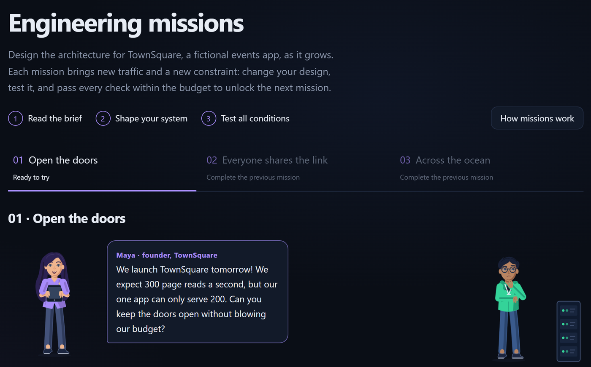

<p align="center">
  
</p>

<h1 align="center">Packets in Motion</h1>

<p align="center"><strong>System design, explained by watching it happen.</strong></p>

An animated, interactive course that takes you from "how do two computers talk?" to consensus, distributed transactions and three full system designs: a URL shortener, a chat app and a news feed. Every concept is taught through motion: glowing requests leave light trails between servers, caches fill up, servers fail and traffic reroutes. Then you put it to work: a hands-on challenge for every lesson, ten **architecture labs** where you build and load-test the system yourself, and a story of **engineering missions** for a growing app.


## Highlights

- **45 animated lessons** in 10 sections, from packets and ports to Raft, sagas and three capstone designs. Every step is narrated in captions and a transcript.
- **A challenge for every lesson**, scored with up to three stars, plus a quiz for each section.
- **10 architecture labs:** drag in components, wire them, and watch your design survive (or not) a spike, a crash or an attack. The results point at the weakest part.
- **Engineering missions:** help Maya, the founder of TownSquare, take her app from launch day to two regions, adapting one design as the constraints change.
- **A guided start:** a single way in from Home, a one-minute interactive introduction to what system design is, a first-visit tour and a learning map that shows where you are.
- **One offline HTML file.** No install, no account, no network requests. Progress stays in your browser and can be exported.
- **Built for everyone:** full keyboard control, screen-reader narration, Dark, Light and High contrast themes, and reduced-motion support.

## Run it

**Live:** [sumnoon.github.io/Packets-in-Motion](https://sumnoon.github.io/Packets-in-Motion/)

Or run it offline: `index.html` is a single self-contained file with no dependencies and no network requests. Download it and open it in any modern browser. That's it.

## Getting started

- **Home** has one job: a single way in. New visitors see **Start learning** with their first lesson, plus a link to the introduction. Returning learners see **Continue learning**, which reopens their last lesson at its saved position, speed included, without autoplay.
- **First-visit tour:** the very first time you open the course, a short guided tour points at each part of the page in turn (Home, Learning map, Missions, the chapter list, Settings and the start button), with Back, Next and Skip. It appears once; **Settings → Take the tour again** replays it.
- **The introduction, "What is system design?"**, takes about a minute in six steps. It starts by showing that every app is a system: a tap travels across the internet to servers and a database, and the answer comes back. System design is arranging those computers so the app stays fast, reliable and affordable as it grows. Then you try it with Maya's app: send a traffic spike and watch one app overload and turn readers away, add a second app that sits idle, then add a load balancer and see the dropped reads disappear. The last step recaps what you did and why system design is useful to anyone (building apps, interviews, working with engineers, everyday curiosity), then offers the next lesson on your path. It's self-paced, with no timer or account.
- **Learning map** draws each section as a route and each lesson as a station, marks **You are here** (your paused lesson, or your path's next one), and shows completion, challenge stars and suggested prerequisites. Choose your path there: **Learn the basics**, **Prepare for interviews** or **Explore systems**.
- **The chapter list** in the sidebar still lists every lesson and quiz; search it with `/`.

## What's inside

<!-- course-counts:start -->
45 chapters in 10 sections; 10 architecture labs; 9 section quizzes. Lesson animations run 28.5–62 seconds.

| Section quiz | Questions |
| --- | ---: |
| Foundations | 7 |
| Traffic | 9 |
| Data | 9 |
| Storage & Search | 6 |
| Communication | 7 |
| Reliability | 7 |
| Architecture | 6 |
| Advanced | 14 |
| Capstone | 7 |
<!-- course-counts:end -->

From zero to advanced:

| Section | Chapters |
| --- | --- |
| Start Here | How computers talk: packets, IP addresses & ports |
| Foundations | Client–server & typing a URL · Latency vs throughput, vertical vs horizontal scaling · Autoscaling · Back-of-the-envelope estimation |
| Traffic | Load balancers · Sessions: sticky vs shared storage · Reverse proxies & API gateways · Authentication: sessions, JWTs & OpenID Connect · CDNs & edge caching · Rate limiting |
| Data | SQL vs NoSQL · Indexing · Replication · Quorums (N, W, R) · Sharding · Caching & LRU · Cache expiry (TTL) & invalidation · Hot keys & request coalescing · Bloom filters · CAP & consistency |
| Storage & Search | B-trees vs LSM trees · Search with inverted indexes · Geospatial indexes: geohash & quadtrees |
| Communication | REST vs gRPC vs WebSockets · Message queues & pub/sub · Sync vs async · Stream vs batch processing |
| Reliability | SPOFs & redundancy · Timeouts & deadlines · Health checks, failover, circuit breakers, retries · Idempotency · Safe deploys: blue-green, canary & feature flags |
| Architecture | Monolith vs microservices · Event-driven · Observability |
| Advanced | Consensus & leader election (Raft) · Distributed locks, leases & fencing tokens · Conflict resolution: vector clocks & CRDTs · Two-phase commit & sagas · Snowflake IDs · Back-pressure & load shedding |
| Capstone | Design a URL shortener · Design a chat app · Design a news feed, each end to end |

Each chapter has play/pause/replay, a scrubber with step markers, synced captions, a transcript, and a "When to use it / Trade-offs" card at the end. Each section with more than one chapter ends with a **section quiz**, with an explanation for every answer, scored with stars like the challenges. A miss names the chapter worth rewatching.

## Challenges

Every lesson ends with a hands-on challenge played on the same stage, scored with 0–3 stars (saved in your browser and shown in the sidebar). A few examples:

- **Be the load balancer**: route requests by hand for 30 seconds without overflowing a server.
- **Beat LRU**: choose what to evict from a tiny cache and try to match the algorithm.
- **Stop the retry storm**: tune retries, backoff, jitter and a circuit breaker through an outage.
- **Find the culprit**: use metrics, logs and a trace to find a slow service.

The rest use the same kinds of mechanics: sort cards into boxes, put steps in order, or tune a system and run it.

**Start challenge** (or your first answer) starts the clock; **Pause challenge** freezes it, including delayed results. Reading the glossary, opening the mobile chapter drawer, or hiding the tab pauses automatically. Timed sorting games and load balancing also offer **Untimed** practice before starting. Untimed balancing finishes after 30 routed requests; each choice advances service by one second, with no request deadlines or idle progress.

### Architecture labs


Ten challenges are **architecture labs**: you design the system yourself. Drag components (load balancers, app servers, caches, databases, queues, gateways, pub/sub and so on) from a palette onto the board, drag from a component's ● to another to wire them, then run a load test. Traffic flows along the wires you drew, every component has its own capacity, and a crash, a spike or an attack hits whatever you built. The results name the weakest part of your design.

- **Survive launch day**: one giant machine or several smaller ones behind a load balancer? Traffic climbs and the busiest machine crashes.
- **Keep everyone logged in**: decide where sessions live, then lose a server and the session store's machine.
- **Keep it serving**: a leader, followers that copy it, and a failover manager; the leader crashes halfway.
- **Survive the order surge**: put a queue between the shop and the workers, and size the workers to catch up after a spike and a restart.
- **Make checkout fast**: wire each job straight from checkout (the customer waits) or through a queue (it happens later), then survive declined cards and an email outage.
- **Wire up the events**: subscribe each service to the events it must react to, and nothing else.
- **Survive the chaos monkey**: find every single point of failure before an app server, a load balancer and the database are killed.
- **Build the shortener**: survive a viral spike, the busiest app server crashing and a bot attack, and count every click.
- **Build the chat app**: keep 100,000 people connected through a message storm, a gateway crash and offline members.
- **Build the news feed**: get posts to followers fast, survive a celebrity post and a 20× spike in feed loads.

#### Feedback and hints

After a run that falls short, the board marks the weak spots: the component that overloaded and when, or the wire where requests failed. **Hint** goes a level deeper with each press: a nudge, then the components you need, then a faint outline of a 3-star design to trace. Each lab remembers your cheapest 3-star design, with a **lean medal** where a cheaper one exists.

Expand **Model assumptions and replay** for capacity, cost and latency assumptions. Dollar values are educational model parameters, not provider quotes; latency figures are illustrative buckets. The chat lab measures modeled recipient delivery, with successful replay assumed when resume is enabled. It does not measure message timestamps or certify a one-second end-to-end delivery deadline. The shortener only earns three stars when every successful redirect's click event has been persisted, with none left pending.

#### Undo, saving and replay

**Undo** (or Ctrl+Z) covers board components, connections, positions and design options. Component locks and chaos mode are practice settings rather than board edits. Lab drafts, including wires and design options, survive reloads. **Restore best design** brings back the cheapest saved three-star board; restoring it can also be undone. Older progress files retain their best-cost records, and a new successful run saves a restorable board.

**Replay last run** restores the last tested board, its options, incident mode and seed, including after a reload. Last-run replay records stay in the current browser; progress exports include drafts, best boards and certification seeds. Replaying a seed does not earn another distinct certification run.

#### Chaos mode, sharing and component locks

Once a design holds, turn on **chaos mode**: every run, the incidents strike at a random time and hit a random component, and three 3-star runs with distinct random seeds on the same architecture earn its chaos-proof badge. Changing components, wires or options resets the streak; moving a component does not. The tested design and seeds are saved and exported. Earlier badges remain learner achievements, but do not certify an untested board.

**Copy share link** packs your design into a link, so anyone who opens it gets the same board and can try to beat your cost. Shared boards are saved before their URL is tidied, so they survive reloads too. When using the downloaded HTML, share links open the hosted course. If clipboard access fails, the selectable link remains available to copy manually.

Components grow with the course: a component stays locked until you mark its prerequisite lesson complete, and each locked component links straight to that lesson. Already know the material? Turn off **Lock components until I have completed their chapter** in any lab.

#### Keyboard and text controls

Labs work with the keyboard too: digits add components, pressing two components' letters wires them, Delete removes the selection, Ctrl+Z undoes, and Enter runs the test. The goal appears above the board, and Run, Undo and Hint stay available in a sticky toolbar. The live status announces only the latest action; a persistent design summary lists budget, components, connections, options and weak spots. Expand the text editor for an add → connect → run walkthrough, or the keyboard guide for shortcuts and costs.

## Engineering missions



**Missions** follow TownSquare, a fictional local-events app, as it grows. You're its engineer: adapt one design across three missions and test it against every named traffic and failure condition instantly.

| Mission | What happens | To pass |
| --- | --- | --- |
| 01 · Open the doors | Launch day: 300 page reads a second, and one app serves 200 | Serve at least 99% of reads within 7 credits |
| 02 · Everyone shares the link | Reads triple to 900 a second, and an East app may fail; most readers want the same event pages | Serve at least 99% in every condition within 11 credits |
| 03 · Across the ocean | 1,200 reads a second, 40% from the West; crossing the ocean takes 180 ms | Serve at least 99%, with 95% within 100 ms, in every condition, including an app failure on either side, within 20 credits |

The page explains itself: a title and goal, three steps (read the brief, shape your system, test all conditions), and on the first visit a short **How missions work** introduction, which the button of the same name brings back. Choose app servers, a load balancer, a cache and later a second region; the diagram updates as you go. Passing a mission unlocks the next, and your design carries over.

The story has a cast. **Maya**, TownSquare's founder, delivers each brief in her own words and reacts to your results: worried when readers are turned away, celebrating when the design holds. **You**, the engineer, stand beside a server rack whose lights show how the system is doing: healthy, under load, or a failed unit blinking red. Each mission has its own postcard beside the goal (launch day, the viral night, going global). Small effects carry the mood: confetti and a sparkle when a design passes, a sweat drop and an alert over the rack when it fails. Both characters are full-body, layered vector art with breathing, blinking and celebration motion; all of this motion switches off under reduced motion. Their poses, expressions and character sheets live in [assets/maya](assets/maya) and [assets/engineer](assets/engineer); the racks, postcards and effects live in [assets/mission-art](assets/mission-art).

Missions are deterministic teaching capacity checks, with the model's assumptions available beside the design, rather than the animated load tests used in architecture labs. Credits are teaching units, not provider prices. Mission completion is separate from lesson stars, and nothing is timed. Mission drafts, passing designs, your chosen path and introduction completion are saved locally and included in progress exports; imported mission evidence is rechecked against the model before any records are merged.

## Learning tools

- **Search** the sidebar (press `/`) by title, caption or trade-off: "stampede", "429" or "leader" all find the right chapters.
- **Glossary:** key terms in captions, the transcript and the trade-offs are underlined; hover, focus or tap one for a one-line definition. Press G for the full glossary, with links to every chapter that uses each term.
- **Before this / Related:** the trade-offs card links to the chapters a lesson builds on and the ones that go further.
- **Completion:** **Mark lesson complete** records your own completion decision; reaching or seeking to the end does not mark completion. Challenge stars record practice separately, and three stars indicate challenge mastery. Older watched records are retained as completed records for compatibility.
- **History:** chapter and quiz changes create browser-history entries; Back and Forward restore lessons paused at their saved position, or reopen challenges ready to start. Timeline changes update the current entry without creating more entries. Playback speed, captions and transcript preferences are remembered.
- **Stage recovery:** a failed drawing stops playback and offers Retry or the readable lesson transcript while keeping saved lab designs. Trade-offs and results use modal dialogs with keyboard focus containment and Escape to close.

The ID lesson distinguishes sequences that allow gaps, transactional business-number allocation, random UUIDv4, time-based UUIDv7, and Snowflake's clock-dependent timestamp ordering. The authentication lesson separates OAuth API authorization from OpenID Connect login, explains access versus ID tokens, and covers validation and authorization code flow with PKCE. References: [PostgreSQL sequences](https://www.postgresql.org/docs/18/functions-sequence.html), [UUID specification](https://www.rfc-editor.org/rfc/rfc9562.html), [Snowflake generator safeguards](https://github.com/twitter-archive/snowflake/blob/snowflake-2010/src/main/scala/com/twitter/service/snowflake/IdWorker.scala), [OpenID Connect Core](https://openid.net/specs/openid-connect-core-1_0.html), and [PKCE](https://www.rfc-editor.org/rfc/rfc7636.html).

## Settings and progress

- **Settings** (⚙ in the top navigation, on every page): theme, keyboard shortcuts, sound cues, progress export / import, and the tour. No scrolling to the bottom of the chapter list.
- **Export / import progress** from Settings. Progress (chapters completed, stars, lab drafts, your cheapest saved lab designs, chaos-proof badges and mission progress) lives in your browser, so this is how you move it to another browser or keep a backup. Importing merges: nothing you have already earned is lost, and an existing draft is kept. Both original version 1 files and the new version 2 files are supported. Files are limited to 1 MB; invalid supported records or design schemas reject the whole import before merging, and unknown course records are reported as ignored.
- **Storage:** if browser storage is unavailable or full, the sidebar asks you to export before closing the tab.
- **Sound cues** (off by default): soft tones for right and wrong moves, new steps and results. They are synthesized in the browser; nothing is downloaded.

## Visual language

The project logo traces a **P** with a routing path and two traveling packets, using the course's blue, mint, and violet palette. Transparent logo assets, the social preview and how to refresh both are in [assets/BRAND.md](assets/BRAND.md).

- Servers are rounded rectangles, databases are cylinders, users are circles, and requests are glowing dots.
- **Blue** = request · **green** = success / response · **red** = failure · **amber** = cached / queued.
- Maya wears the course's violet and the engineer its mint, so each character carries a palette colour.

## Controls

| Key | Action |
| --- | --- |
| Space | Play / pause |
| ← / → | Seek 2 s |
| `[` / `]` | Previous / next chapter |
| P | Start the chapter's challenge (Esc to leave) |
| 1–9 | Jump to a step |
| C | Toggle captions |
| S | Transcript: every step as text; click one to jump there |
| T | Trade-offs card |
| F | Fullscreen |
| / | Search chapters |
| G | Glossary |

In a challenge, number keys (or letters, in the put-in-order games) do everything the mouse does; each target on the stage shows its key.

Player shortcuts work while focus is inside the lesson. Native inputs retain their keys, and Ctrl, Command and Alt combinations retain their browser behavior (Ctrl/Command+Z on the challenge canvas performs lab undo). **Keyboard shortcuts** in Settings turns the single-key shortcuts off. Timeline arrows use the slider's native behavior; **Previous lesson step** and **Next lesson step** jump between narrated beats, and the slider reports elapsed time and the current step to assistive technology.

The course works in portrait and landscape. **Readable size** enlarges the diagram in a scrollable viewport; **Fit diagram** restores the overview. Touch scrolling is the default. In challenges, **Drag on diagram** enables canvas editing; turn it off to pan. The lab's **Components and connections** editor provides text controls for adding, removing, wiring and unwiring components, with the same budget limits and undo history. Live challenge measurements expose server loads, cache contents, search postings and lab capacity readings as text.

## Accessibility

- **Screen readers:** each step is announced as it plays (title and caption), the stage is labelled with the current step, and the transcript (S) lists every step as text. The sidebar reads each chapter's number, title, whether you've marked it complete and your stars. Mission characters have text descriptions, and their lines appear as text in speech bubbles.
- **Keyboard only:** every lesson control, challenge, lab, mission and the tour work without a mouse. Challenge status lines name the cards, slots and targets so you know which key does what. Dialogs and the tour keep focus inside until closed.
- **Themes:** pick Dark, Light or High contrast in Settings. The stage stays dark in Light (it's the video); High contrast also brightens labels and lines on the stage. High contrast is chosen for you if your system asks for more contrast.
- **Reduced motion** stills the drifting background, tones down the particle bursts, turns off the labs' screen shake and slow motion, and stops the characters' and the introduction's movement.

## How it works

The diagrams are drawn on a `<canvas>` by code. Each chapter is a pure `draw(t)` function, so `seek(t)` reproduces any moment exactly. Lesson timelines are precomputed. Challenges advance through `update(now, dt)` independently of drawing; architecture labs use a seeded, headless model with fixed 1/60-second steps and an exact end time. Presentation effects use a separate random stream. See [simulation contracts](docs/simulation-contracts.md) for lifecycle, graph, events, scoring and replay.

The learning views (Home, the introduction, the map and missions) are HTML rendered from a small deterministic model, and the mission characters are native SVG embedded in the page, so the course stays one offline file.

The consensus, quorum, SQL migration, saga and vector-clock lessons state their protocol assumptions and failure cases. Primary references: [Raft](https://raft.github.io/raft.pdf), [Dynamo](https://www.allthingsdistributed.com/files/amazon-dynamo-sosp2007.pdf), [PostgreSQL table modification](https://www.postgresql.org/docs/18/ddl-alter.html), and [compensating transactions](https://learn.microsoft.com/en-us/azure/architecture/patterns/compensating-transaction).

## Development

`index.html` is generated from the files in `src/`. Edit those, then rebuild:

| Path | What it holds |
| --- | --- |
| `src/page.html` | The page skeleton. Its `<!-- include: … -->` lines set which files go in and in what order. |
| `src/styles.css` | Core styles |
| `src/journey.css` | Styles for Home, the introduction, the learning map, missions, Settings, the tour and the characters |
| `src/engine.js` | Drawing primitives: servers, databases, packets, easing |
| `src/simulation.js` | JSDoc contracts, independent random streams, fixed clock and headless lab runner |
| `src/storage.js` | Safe browser storage and validation of saved progress |
| `src/chapters/<id>.js` | One lesson each: beats, trade-offs and `draw(t)` |
| `src/challenges/<id>.js` | One challenge each. `_mechanics.js` holds the shared game types; `_lab.js` is the architecture-lab engine (board, wiring, load tests, hints, weak spots, chaos mode, share links). |
| `src/quizzes/<section>.js` | One quiz per section: questions, answers (right one first) and explanations |
| `src/glossary.js` | Glossary terms, definitions and other spellings |
| `src/journey-model.js` | Learning paths, the introduction's model and the missions' deterministic trials and saved-progress rules |
| `src/journey.js` | Home, the introduction, the learning map and the missions pages |
| `src/characters.js` | Mission scenes: places Maya, the engineer and the server rack, with speech bubbles and mood effects |
| `src/character-assets.js` | Generated: the characters' poses as embedded SVG (do not edit) |
| `src/mission-art-assets.js` | Generated: the racks, postcards and effects the missions use, as embedded SVG (do not edit) |
| `src/player.js` | The player: controls, sidebar, progress, challenge mode, Settings and the first-visit tour |
| `scripts/build-characters.mjs` | Editable character geometry; writes `assets/maya`, `assets/engineer` and `src/character-assets.js` |
| `scripts/build-mission-art.mjs` | Editable mission art geometry; writes `assets/mission-art` and `src/mission-art-assets.js` |

You need [Node.js](https://nodejs.org/) 22 or newer. Building and VM tests use Node alone. Browser tests use the locked development dependency on Playwright:

```bash
npm run build
```

```bash
npm test
npm ci
npx playwright install chromium
npm run test:browser
```

`npm run build` regenerates the character art, writes `index.html`, inlines logo assets and generates the counts above from registered course metadata. Commit the rebuilt files; `npm run check` verifies the character assets, the HTML and the README counts are all up to date.

`npm test` uses a stand-in canvas to check lesson drawing, seeded challenge play, keyboard controls, lab solutions, mission models, characters and model invariants. It checks negative radii, gradient stops and colours, but does not reproduce browser layout, HTML semantics or native focus. `npm run test:browser` checks those boundaries in Chromium at desktop and touch portrait sizes: Home, the tour, the introduction, the map, missions, Settings, delayed navigation, reload/import/share and seed replay. CI runs both suites and saves browser traces/screenshots on failure. These automated touch and semantic checks do not replace physical-device or screen-reader testing; full assistive-technology coverage has not been verified.

To add a chapter, create `src/chapters/<id>.js` (and `src/challenges/<id>.js`), add an include line for each in `src/page.html`, then build and test. Give it `needs` and `related` chapter ids for the trade-offs card links. The tests check that every link points at a real chapter, every quiz question names one, and every glossary term appears somewhere in the course.

Every push to `main` deploys the site to GitHub Pages.

## License

[MIT](LICENSE)
